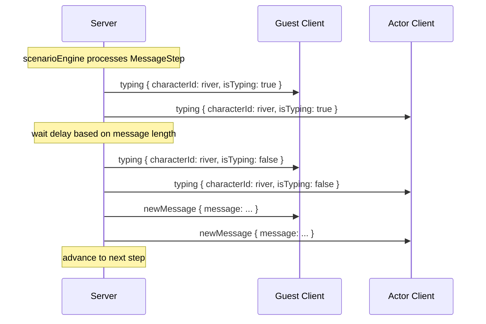
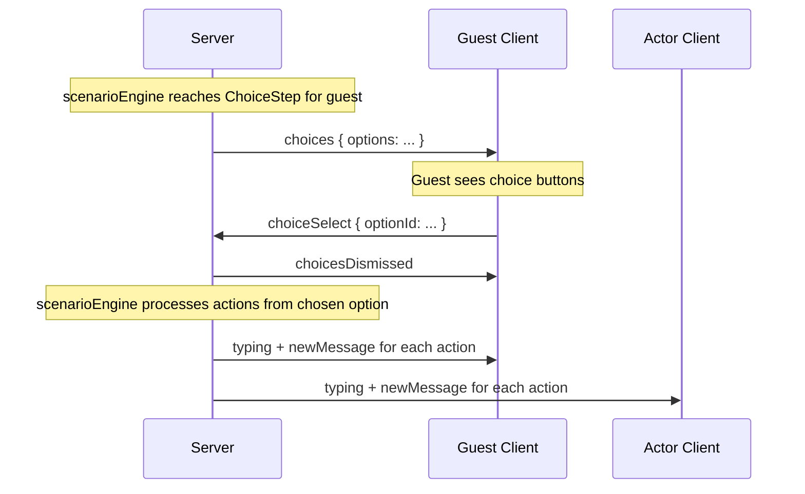
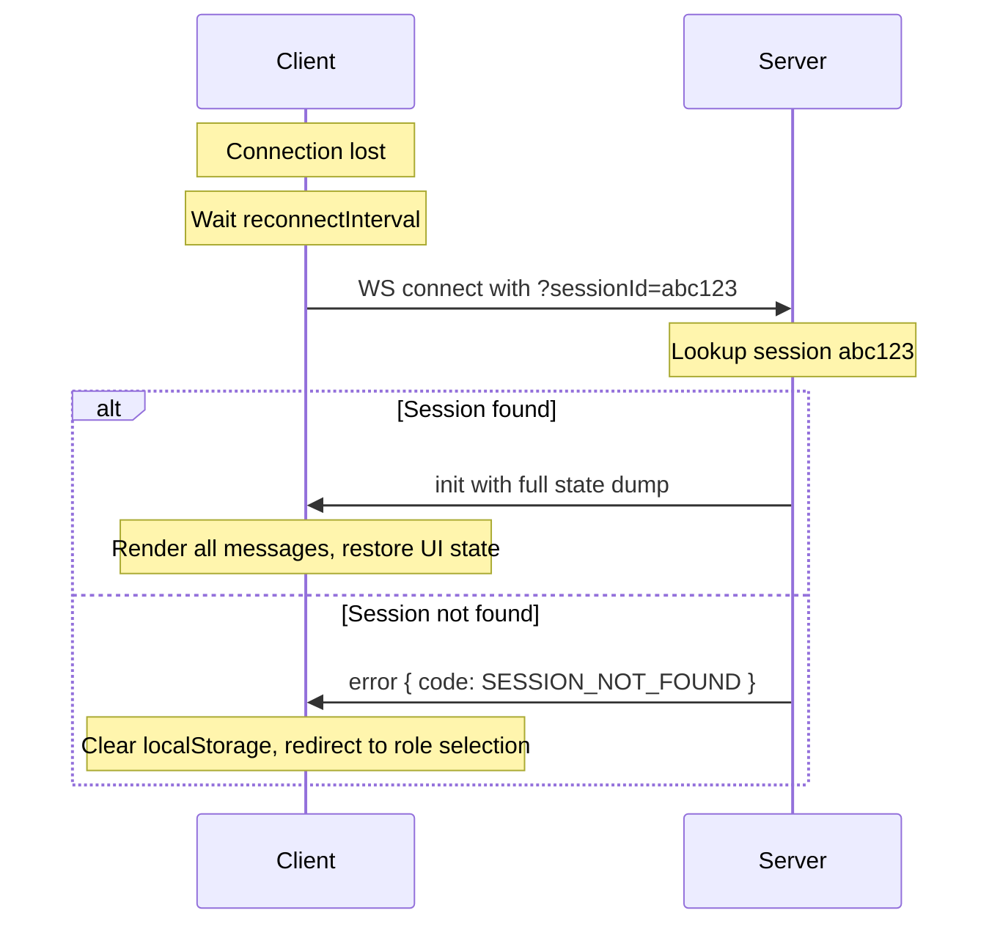
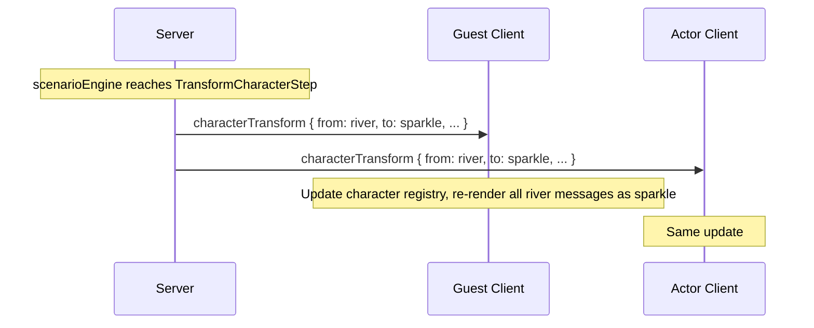
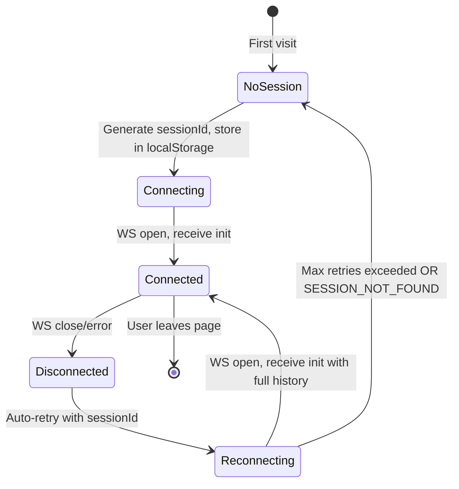
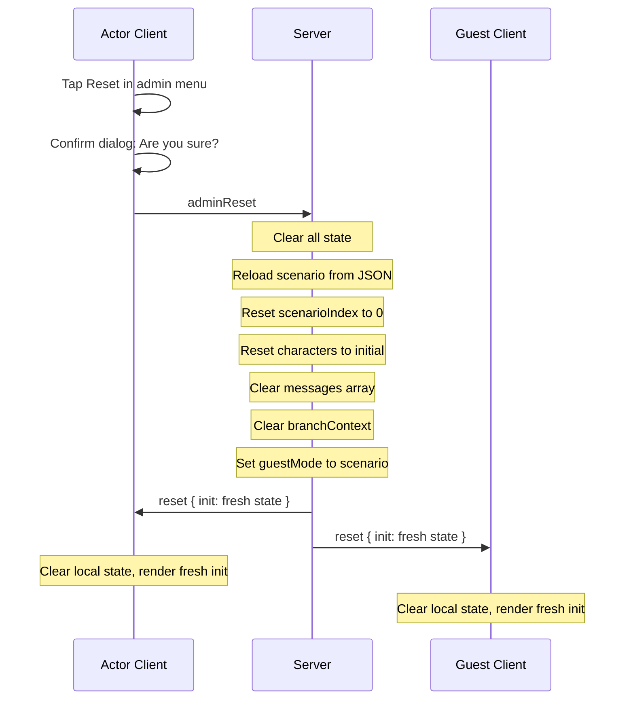

# 🎭 Honkai Star Rail Chat Simulation — Architecture

> **Single source of truth** for the «Где исполняются мечты» group chat simulation.
> A real-time multiplayer scenario-driven chat app mimicking the HSR in-game messenger.

---

## Table of Contents

1. [Project Structure](#1-project-structure)
2. [Data Models](#2-data-models)
3. [WebSocket Protocol](#3-websocket-protocol)
4. [Server Architecture](#4-server-architecture)
5. [Client Architecture](#5-client-architecture)
6. [Scenario JSON Schema](#6-scenario-json-schema)
7. [UI Design Tokens](#7-ui-design-tokens)
8. [State Recovery](#8-state-recovery)
9. [Admin Features](#9-admin-features)

---

## 1. Project Structure

```
honkai-chat/honkai-chat/
├── client/                          # React + Vite frontend
│   ├── public/
│   │   ├── avatars/                 # Character avatar images
│   │   │   ├── clerk.webp
│   │   │   ├── sunday.webp
│   │   │   ├── firefly.webp
│   │   │   ├── himeko.webp
│   │   │   ├── river.webp
│   │   │   └── sparkle.webp
│   │   ├── stickers/                # Sticker packs per character
│   │   │   ├── clerk/
│   │   │   ├── sunday/
│   │   │   ├── firefly/
│   │   │   ├── himeko/
│   │   │   └── sparkle/
│   │   └── images/                  # In-chat images (origami instructions, etc.)
│   ├── src/
│   │   ├── main.tsx                 # Entry point
│   │   ├── app.tsx                  # Router: /guest, /actor
│   │   ├── components/
│   │   │   ├── chat/
│   │   │   │   ├── chatPage.tsx         # Top-level page layout (header + messages + bottom)
│   │   │   │   ├── chatHeader.tsx       # Title, subtitle, admin menu trigger
│   │   │   │   ├── messageList.tsx      # Scrollable message area
│   │   │   │   ├── messageBubble.tsx    # Single message: text, img, sticker
│   │   │   │   ├── actionMessage.tsx    # Centered system message
│   │   │   │   ├── typingIndicator.tsx  # Three shimmer dots
│   │   │   │   ├── choicePanel.tsx      # Scenario choice buttons at bottom
│   │   │   │   └── freeInput.tsx        # Free mode: text input + sticker/image buttons
│   │   │   ├── admin/
│   │   │   │   ├── adminMenu.tsx        # Dropdown: reset, character switch
│   │   │   │   └── characterPicker.tsx  # Character selection grid
│   │   │   ├── stickers/
│   │   │   │   └── stickerPicker.tsx    # Sticker pack overlay
│   │   │   └── shared/
│   │   │       ├── avatar.tsx           # Circular avatar component
│   │   │       └── modeToggle.tsx       # Scenario/Free mode toggle (actor only)
│   │   ├── hooks/
│   │   │   ├── useWebSocket.ts      # WS connection, reconnection, message dispatch
│   │   │   ├── useChat.ts           # Chat state: messages, typing, choices
│   │   │   └── useSession.ts        # sessionId management in localStorage
│   │   ├── context/
│   │   │   └── chatContext.tsx       # Global chat state provider
│   │   ├── lib/
│   │   │   ├── wsClient.ts          # Low-level WebSocket wrapper with reconnect
│   │   │   ├── messageFactory.ts    # Helpers to create client→server messages
│   │   │   └── characters.ts        # Character metadata registry (client-side)
│   │   ├── types/                   # Client-only types (re-exports shared + UI-specific)
│   │   │   └── index.ts
│   │   └── styles/
│   │       ├── global.css           # CSS variables, reset, fonts
│   │       ├── chat.css             # Chat layout, bubbles, messages
│   │       ├── admin.css            # Admin menu styles
│   │       └── animations.css       # Typing indicator shimmer, transitions
│   ├── index.html
│   ├── vite.config.ts
│   ├── tsconfig.json
│   └── package.json
│
├── server/                          # Node.js + Express + ws backend
│   ├── src/
│   │   ├── index.ts                 # Entry: HTTP server + WS upgrade
│   │   ├── wsHandler.ts             # WebSocket connection manager
│   │   ├── scenarioEngine.ts        # Sequential scenario processor
│   │   ├── state.ts                 # In-memory server state
│   │   ├── characters.ts            # Character registry with transform support
│   │   ├── broadcast.ts             # Message broadcasting utilities
│   │   ├── types/                   # Server-only types
│   │   │   └── index.ts
│   │   └── scenario/
│   │       └── penaconia.json       # The Пенакония scenario data
│   ├── tsconfig.json
│   └── package.json
│
├── shared/                          # Shared TypeScript types — imported by both
│   ├── protocol.ts                  # All WS message types (server↔client)
│   ├── models.ts                    # Character, Message, ScenarioStep, etc.
│   └── constants.ts                 # Character IDs, role names, timing defaults
│
├── package.json                     # Root workspace config
└── tsconfig.base.json               # Shared TS config
```

### Workspace Setup

Root `package.json` uses npm workspaces:

```json
{
  "name": "honkai-chat",
  "private": true,
  "workspaces": ["client", "server", "shared"]
}
```

Both `client` and `server` reference `shared` via:
```json
{
  "dependencies": {
    "@honkai-chat/shared": "workspace:*"
  }
}
```

`shared/package.json`:
```json
{
  "name": "@honkai-chat/shared",
  "main": "./models.ts",
  "types": "./models.ts"
}
```

---

## 2. Data Models

All types live in `shared/` and are imported by both client and server.

### `shared/constants.ts`

```typescript
// --- Character IDs ---
const characterIds = ['clerk', 'sunday', 'firefly', 'himeko', 'river', 'sparkle'] as const;
type CharacterId = typeof characterIds[number];

// --- Roles ---
const roles = ['guest', 'actor'] as const;
type Role = typeof roles[number];

// --- Actor Modes ---
const actorModes = ['scenario', 'free', 'root'] as const;
type ActorMode = typeof actorModes[number];

// --- Guest Modes ---
const guestModes = ['scenario', 'free'] as const;
type GuestMode = typeof guestModes[number];

// --- Timing ---
const timing = {
  typingDelayBase: 1500,       // base typing indicator duration (ms)
  typingDelayPerChar: 30,      // additional ms per character in message
  typingDelayMax: 5000,        // cap on typing delay
  choiceTimeout: 0,            // 0 = no timeout, wait indefinitely
  reconnectInterval: 2000,     // ms between reconnect attempts
  reconnectMaxAttempts: 10,
} as const;
```

### `shared/models.ts`

```typescript
// ─── Characters ───

interface CharacterDef {
  id: CharacterId;
  name: string;                    // display name
  avatarUrl: string;               // path to avatar image
  stickerPack: string[];           // array of sticker URLs
  color: string;                   // accent color for username label
}

// Character registry — the "river" entry transforms into "sparkle" mid-scenario
// Server maintains a `characterStates` map that holds the CURRENT state of each character.
// When `transformCharacter` fires, the server updates the entry and broadcasts the change.

// ─── Messages ───

type MessageType = 'text' | 'img' | 'sticker' | 'action';

interface ChatMessage {
  id: string;                      // uuid
  characterId: CharacterId;        // who sent it (or 'system' for actions)
  type: MessageType;
  value: string;                   // text content | image URL | sticker URL | action text
  timestamp: number;               // Date.now()
}

// Client-side enrichment (NOT stored on server, computed on render):
interface DisplayMessage extends ChatMessage {
  source: 'incoming' | 'outgoing'; // based on current user's character
  isLoading: boolean;              // true during typing animation phase
  characterName: string;           // resolved from current character state
  avatarUrl: string;               // resolved from current character state
}

// ─── Scenario Steps ───

// Every step in the scenario array is one of these discriminated unions:

interface MessageStep {
  type: 'message';
  characterId: CharacterId;
  messageType: 'text' | 'img' | 'sticker';
  value: string;
  delay?: number;                  // override typing delay (ms)
}

interface ChoiceStep {
  type: 'choice';
  target: 'guest' | 'actor';      // who sees the buttons
  targetCharacterId?: CharacterId; // if actor, which character must be active (optional)
  options: ChoiceOption[];
}

interface ChoiceOption {
  id: string;                      // unique option identifier
  label: string;                   // short action description shown on button
  actions: ScenarioAction[];       // sequence of things that happen when selected
}

// Actions triggered by a choice:
type ScenarioAction =
  | { type: 'message'; characterId: CharacterId; messageType: 'text' | 'img' | 'sticker'; value: string; delay?: number }
  | { type: 'action'; value: string }                          // system message
  | { type: 'delay'; ms: number }                              // pause between actions
  ;

interface ActionStep {
  type: 'action';
  value: string;                   // system message text (e.g., "Река вышла из чата")
}

interface TransformCharacterStep {
  type: 'transformCharacter';
  fromId: CharacterId;             // 'river'
  toId: CharacterId;               // 'sparkle'
  newName: string;                 // 'Искорка'
  newAvatarUrl: string;            // '/avatars/sparkle.webp'
}

interface SwitchGuestModeStep {
  type: 'switchGuestMode';
  mode: GuestMode;                 // 'free' or 'scenario'
}

interface BranchStep {
  type: 'branch';
  branches: Record<string, ScenarioStep[]>; // keyed by choiceOption.id from previous choice
}

type ScenarioStep =
  | MessageStep
  | ChoiceStep
  | ActionStep
  | TransformCharacterStep
  | SwitchGuestModeStep
  | BranchStep;

// ─── Session ───

interface Session {
  sessionId: string;
  role: Role;
  characterId: CharacterId;        // current active character
  actorMode?: ActorMode;           // actor only
  guestMode?: GuestMode;           // guest only
  connectedAt: number;
}
```

### `shared/protocol.ts`

See [Section 3: WebSocket Protocol](#3-websocket-protocol) for the complete message specifications.

---

## 3. WebSocket Protocol

### Connection URL

```
ws://localhost:3001/ws?role=guest|actor&characterId=clerk|sunday|firefly|himeko|river&sessionId=<uuid>
```

- `role` — `guest` or `actor` (required on first connection)
- `characterId` — initial character (required; guest always `clerk`)
- `sessionId` — UUID from localStorage (optional on first connection; server generates if absent)

### Message Envelope

All WebSocket messages are JSON with a discriminated `type` field:

```typescript
interface WsEnvelope {
  type: string;
  [key: string]: unknown;
}
```

---

### Server → Client Messages

```typescript
// ─── 1. Init/Sync ───
// Sent on connection (or reconnection). Full state dump.
interface ServerInit {
  type: 'init';
  sessionId: string;                     // store in localStorage
  role: Role;
  characterId: CharacterId;
  messages: ChatMessage[];               // full message history
  characters: Record<CharacterId, CharacterDef>;  // current character states
  scenarioIndex: number;                 // current position in scenario
  guestMode: GuestMode;                  // current guest mode
  activeChoices: ActiveChoice | null;    // pending choice for this client, if any
  connectedSessions: SessionInfo[];      // who's connected
}

interface SessionInfo {
  sessionId: string;
  role: Role;
  characterId: CharacterId;
}

interface ActiveChoice {
  stepIndex: number;
  options: { id: string; label: string }[];
}

// ─── 2. New Message ───
// A message has been committed to the chat history.
interface ServerNewMessage {
  type: 'newMessage';
  message: ChatMessage;
}

// ─── 3. Typing Indicator ───
// Show/hide typing dots for a character.
interface ServerTyping {
  type: 'typing';
  characterId: CharacterId;
  isTyping: boolean;
}

// ─── 4. Choices ───
// Server presents choice buttons to the target player.
interface ServerChoices {
  type: 'choices';
  stepIndex: number;                     // scenario step that generated this
  options: { id: string; label: string }[];
}

// ─── 5. Choices Dismissed ───
// Choices were resolved (someone picked one). Remove buttons.
interface ServerChoicesDismissed {
  type: 'choicesDismissed';
}

// ─── 6. Character Transform ───
// A character's identity has changed (Река → Искорка).
interface ServerCharacterTransform {
  type: 'characterTransform';
  fromId: CharacterId;
  toId: CharacterId;
  newName: string;
  newAvatarUrl: string;
}

// ─── 7. Reset ───
// Full state reset. Client should clear everything and re-init.
interface ServerReset {
  type: 'reset';
  init: ServerInit;                      // fresh init payload
}

// ─── 8. Guest Mode Switch ───
// The guest's input mode has changed.
interface ServerGuestModeSwitch {
  type: 'guestModeSwitch';
  mode: GuestMode;
}

// ─── 9. Session Update ───
// Someone connected/disconnected/switched character.
interface ServerSessionUpdate {
  type: 'sessionUpdate';
  sessions: SessionInfo[];
}

// ─── 10. Error ───
interface ServerError {
  type: 'error';
  code: string;
  message: string;
}

// Union type for all server messages
type ServerMessage =
  | ServerInit
  | ServerNewMessage
  | ServerTyping
  | ServerChoices
  | ServerChoicesDismissed
  | ServerCharacterTransform
  | ServerReset
  | ServerGuestModeSwitch
  | ServerSessionUpdate
  | ServerError;
```

---

### Client → Server Messages

```typescript
// ─── 1. Choice Select ───
// Player picked a scenario choice.
interface ClientChoiceSelect {
  type: 'choiceSelect';
  optionId: string;
  stepIndex: number;                     // which choice step this responds to
}

// ─── 2. Free Message ───
// Player sends a free-mode message.
interface ClientFreeMessage {
  type: 'freeMessage';
  messageType: 'text' | 'img' | 'sticker';
  value: string;
}

// ─── 3. Admin Reset ───
// Actor requests full state reset.
interface ClientAdminReset {
  type: 'adminReset';
}

// ─── 4. Switch Character ───
// Actor switches to a different character (or root).
interface ClientSwitchCharacter {
  type: 'switchCharacter';
  characterId: CharacterId | 'root';
}

// ─── 5. Switch Actor Mode ───
// Actor toggles between scenario/free mode.
interface ClientSwitchActorMode {
  type: 'switchActorMode';
  mode: ActorMode;
}

// ─── 6. Request Sync ───
// Client explicitly requests full state (e.g., after suspected desync).
interface ClientRequestSync {
  type: 'requestSync';
}

// ─── 7. Advance Scenario (Root only) ───
// In root mode, actor triggers the next scenario step for any character.
interface ClientAdvanceScenario {
  type: 'advanceScenario';
}

// Union type for all client messages
type ClientMessage =
  | ClientChoiceSelect
  | ClientFreeMessage
  | ClientAdminReset
  | ClientSwitchCharacter
  | ClientSwitchActorMode
  | ClientRequestSync
  | ClientAdvanceScenario;
```

---

### Protocol Flow Diagrams

#### Normal scenario flow (message step)



#### Choice flow



#### Reconnection flow



#### Character transform flow



---

## 4. Server Architecture

### Overview

```
┌─────────────────────────────────────────────┐
│                  index.ts                    │
│         HTTP Server + WS Upgrade            │
│                                             │
│  Express serves static client build         │
│  /ws path upgrades to WebSocket             │
└──────────────┬──────────────────────────────┘
               │
               ▼
┌─────────────────────────────────────────────┐
│              wsHandler.ts                    │
│                                             │
│  • Accepts new WS connections               │
│  • Parses query params: role, characterId,  │
│    sessionId                                │
│  • Creates/restores Session objects          │
│  • Routes incoming ClientMessages to the    │
│    appropriate handler                      │
│  • Manages connection lifecycle: onclose,   │
│    onerror, heartbeat                       │
└──────────────┬──────────────────────────────┘
               │
               ▼
┌─────────────────────────────────────────────┐
│                state.ts                      │
│           In-Memory Server State             │
│                                             │
│  serverState = {                            │
│    messages: ChatMessage[]                  │
│    sessions: Map<sessionId, Session>        │
│    connections: Map<sessionId, WebSocket>   │
│    characters: Map<CharacterId, CharDef>    │
│    scenarioIndex: number                    │
│    guestMode: GuestMode                     │
│    pendingChoice: PendingChoice | null      │
│    branchContext: Map<string, string>       │
│  }                                          │
└──────────────┬──────────────────────────────┘
               │
               ▼
┌─────────────────────────────────────────────┐
│           scenarioEngine.ts                  │
│        Sequential Scenario Processor         │
│                                             │
│  • Loads penaconia.json at startup          │
│  • processNextStep(): reads current step    │
│    and executes it                          │
│  • Handles: message, choice, action,        │
│    transformCharacter, switchGuestMode,      │
│    branch                                   │
│  • Pauses at ChoiceSteps until a client     │
│    responds with choiceSelect               │
│  • After choice, executes actions array     │
│    sequentially with delays                 │
│  • For BranchStep, looks up which branch    │
│    was chosen and recurses into it          │
└──────────────┬──────────────────────────────┘
               │
               ▼
┌─────────────────────────────────────────────┐
│            broadcast.ts                      │
│                                             │
│  • broadcastAll(msg): send to all clients   │
│  • broadcastTo(sessionId, msg): single      │
│  • broadcastToRole(role, msg): by role      │
│  • broadcastExcept(sessionId, msg)          │
└─────────────────────────────────────────────┘
```

### Scenario Engine Details

The scenario engine is the heart of the server. It operates as a **sequential step processor** with pause/resume semantics:

```
┌───────────────────────────────────────────────┐
│              scenarioEngine                    │
│                                               │
│  scenario: ScenarioStep[]  ◄── loaded from    │
│  index: number                  penaconia.json│
│  isProcessing: boolean                        │
│  branchContext: Map<string, string>            │
│                                               │
│  processNextStep()                            │
│  ├── MessageStep:                             │
│  │   1. broadcast typing ON                   │
│  │   2. setTimeout(delay)                     │
│  │   3. broadcast typing OFF                  │
│  │   4. create ChatMessage, push to state     │
│  │   5. broadcast newMessage                  │
│  │   6. index++ → processNextStep()           │
│  │                                            │
│  ├── ChoiceStep:                              │
│  │   1. send choices to target client         │
│  │   2. PAUSE — wait for choiceSelect         │
│  │   3. on choiceSelect:                      │
│  │      a. dismiss choices                    │
│  │      b. store choice in branchContext      │
│  │      c. execute actions[] sequentially     │
│  │      d. index++ → processNextStep()        │
│  │                                            │
│  ├── ActionStep:                              │
│  │   1. create system ChatMessage             │
│  │   2. broadcast newMessage                  │
│  │   3. index++ → processNextStep()           │
│  │                                            │
│  ├── TransformCharacterStep:                  │
│  │   1. update characters map in state        │
│  │   2. broadcast characterTransform          │
│  │   3. index++ → processNextStep()           │
│  │                                            │
│  ├── SwitchGuestModeStep:                     │
│  │   1. update guestMode in state             │
│  │   2. broadcast guestModeSwitch             │
│  │   3. index++ → processNextStep()           │
│  │                                            │
│  └── BranchStep:                              │
│      1. lookup last choice from branchContext  │
│      2. select matching branch                │
│      3. execute sub-steps sequentially         │
│      4. index++ → processNextStep()           │
└───────────────────────────────────────────────┘
```

### Key Server Behaviors

**Session management:**
- First connection → server generates `sessionId`, creates Session, sends `init`
- Reconnection with `sessionId` → server finds existing Session, re-attaches WebSocket, sends `init` with full history
- If both `guest` and `actor` are needed to advance, the scenario engine pauses until both roles have at least one connected client
- Only ONE guest session allowed at a time. Multiple actor sessions are allowed (they share the same actor state but each has their own `characterId`)

**Free messages:**
- When a client sends `freeMessage`, server validates:
  - Client is not in root mode
  - Guest is allowed free mode (check `guestMode`)
  - Message type is valid
- Creates `ChatMessage` with the client's current `characterId`
- Broadcasts `newMessage` to all clients

**Root mode:**
- Actor in root mode sees scenario advance buttons for all characters
- `advanceScenario` from root triggers `processNextStep()` regardless of which character the step belongs to
- Root mode actors cannot send free messages

**Reset:**
- Only actors can trigger `adminReset`
- Server clears: `messages[]`, resets `scenarioIndex` to 0, resets `characters` to initial state, clears `branchContext`, sets `guestMode` to `scenario`
- Broadcasts `reset` with fresh `init` payload to all clients

---

## 5. Client Architecture

### Routing

```typescript
// app.tsx — react-router-dom
<Routes>
  <Route path="/guest" element={<ChatPage role="guest" />} />
  <Route path="/actor" element={<ChatPage role="actor" />} />
  <Route path="/" element={<Navigate to="/guest" />} />
</Routes>
```

### Component Tree

```
App
└── ChatPage { role }
    ├── ChatContext.Provider
    │   ├── ChatHeader
    │   │   ├── title: "Где исполняются мечты"
    │   │   ├── subtitle: "Групповой чат съемочной группы."
    │   │   └── [Actor only] AdminMenu trigger (⋯ icon)
    │   │       └── AdminMenu (dropdown)
    │   │           ├── CharacterPicker
    │   │           │   ├── Root option
    │   │           │   ├── sunday
    │   │           │   ├── firefly
    │   │           │   ├── himeko
    │   │           │   └── river/sparkle (dynamic)
    │   │           └── Reset button (with confirm dialog)
    │   │
    │   ├── MessageList (scrollable)
    │   │   ├── MessageBubble (for text/img/sticker)
    │   │   │   ├── Avatar
    │   │   │   ├── Username label
    │   │   │   └── Content (text |  | sticker )
    │   │   ├── ActionMessage (for action type)
    │   │   │   └── Centered text with decorative icon
    │   │   └── TypingIndicator (conditionally shown)
    │   │       └── Three shimmer dots
    │   │
    │   └── BottomActions
    │       ├── [Scenario mode] ChoicePanel
    │       │   └── ChoiceButton[] (stacked, full-width)
    │       ├── [Free mode] FreeInput
    │       │   ├── Text input field
    │       │   ├── Sticker button → StickerPicker overlay
    │       │   ├── Image button (file picker)
    │       │   └── Send button
    │       └── [Actor only] ModeToggle
    │           └── "Сценарий" | "Свободный" toggle
    │
    └── useWebSocket (manages WS lifecycle)
```

### Context & State

```typescript
// chatContext.tsx

interface ChatState {
  // Connection
  role: Role;
  sessionId: string | null;
  isConnected: boolean;

  // Character
  currentCharacterId: CharacterId | 'root';
  characters: Map<CharacterId, CharacterDef>;

  // Messages
  messages: DisplayMessage[];
  typingCharacters: Set<CharacterId>;

  // Scenario
  activeChoices: ActiveChoice | null;
  guestMode: GuestMode;
  actorMode: ActorMode;                    // actor only

  // Connected peers
  sessions: SessionInfo[];
}

interface ChatActions {
  sendFreeMessage: (type: MessageType, value: string) => void;
  selectChoice: (optionId: string, stepIndex: number) => void;
  switchCharacter: (characterId: CharacterId | 'root') => void;
  switchActorMode: (mode: ActorMode) => void;
  advanceScenario: () => void;
  resetChat: () => void;
  requestSync: () => void;
}

// Provider wraps ChatPage, provides state + actions via useContext
```

### Hooks

#### `useSession`
```
- On mount: read sessionId from localStorage
- If absent: generate UUID, store it
- Expose: { sessionId, clearSession }
```

#### `useWebSocket`
```
- On mount: connect to ws://host/ws?role=...&characterId=...&sessionId=...
- On message: dispatch to chatContext reducer
- On close: schedule reconnect with exponential backoff (capped at reconnectMaxAttempts)
- On reconnect: re-send sessionId to restore state
- Expose: { send, isConnected, reconnect }
```

#### `useChat`
```
- Subscribes to chatContext
- Computes DisplayMessage[] from ChatMessage[] + current characterId
- Handles auto-scroll on new messages
- Expose: full ChatState + ChatActions
```

### Message rendering logic

```
for each ChatMessage in messages:
  if message.type === 'action':
    render <ActionMessage text={message.value} />
  else:
    character = characters.get(message.characterId)
    source = (message.characterId === currentCharacterId) ? 'outgoing' : 'incoming'
    render <MessageBubble
      source={source}
      avatar={character.avatarUrl}
      username={character.name}
      type={message.type}
      value={message.value}
      isLoading={message.isLoading}  // only true during typing phase
    />
```

**Typing indicator logic:**
- When `typing { characterId, isTyping: true }` arrives → add to `typingCharacters` set
- Render `<TypingIndicator>` at bottom of message list for each typing character
- When `typing { characterId, isTyping: false }` arrives → remove from set

**Character transform on client:**
- When `characterTransform` arrives → update `characters` map
- All existing messages with `fromId` (`river`) now render with the new name/avatar (`sparkle`)
- This is automatic because `DisplayMessage.characterName` and `avatarUrl` are resolved at render time from the live `characters` map

---

## 6. Scenario JSON Schema

### Schema Definition

```typescript
// The top-level scenario file
interface Scenario {
  id: string;
  title: string;
  description: string;
  initialCharacters: CharacterDef[];      // starting character states
  steps: ScenarioStep[];                  // ordered list of steps
}
```

### Partial Example: First Scene (Пенакония)

```json
{
  "id": "penaconia",
  "title": "Где исполняются мечты",
  "description": "Групповой чат съемочной группы КММ в Пенаконии",
  "initialCharacters": [
    {
      "id": "clerk",
      "name": "Клерк КММ",
      "avatarUrl": "/avatars/clerk.webp",
      "stickerPack": ["/stickers/clerk/01.webp"],
      "color": "#8B7355"
    },
    {
      "id": "sunday",
      "name": "Воскресенье",
      "avatarUrl": "/avatars/sunday.webp",
      "stickerPack": ["/stickers/sunday/01.webp"],
      "color": "#6B5B95"
    },
    {
      "id": "firefly",
      "name": "Светлячок",
      "avatarUrl": "/avatars/firefly.webp",
      "stickerPack": ["/stickers/firefly/01.webp"],
      "color": "#88B04B"
    },
    {
      "id": "himeko",
      "name": "Химеко",
      "avatarUrl": "/avatars/himeko.webp",
      "stickerPack": ["/stickers/himeko/01.webp"],
      "color": "#C0392B"
    },
    {
      "id": "river",
      "name": "Река",
      "avatarUrl": "/avatars/river.webp",
      "stickerPack": [],
      "color": "#3498DB"
    }
  ],
  "steps": [
    {
      "_comment": "=== SCENE 1: ARRIVAL ===",
      "type": "message",
      "characterId": "river",
      "messageType": "text",
      "value": "О, новенький! Клерк КММ? Отлично."
    },
    {
      "type": "message",
      "characterId": "river",
      "messageType": "text",
      "value": "Я — Река, режиссёр. Координирую отсюда, на площадку прийти не могу — долгая история, не спрашивай."
    },
    {
      "type": "message",
      "characterId": "river",
      "messageType": "text",
      "value": "Воскресенье введёт в курс. Слушай его."
    },
    {
      "type": "message",
      "characterId": "sunday",
      "messageType": "text",
      "value": "Фильм — короткий метр. Финансирование КММ. Дедлайн — завтра."
    },
    {
      "type": "message",
      "characterId": "sunday",
      "messageType": "text",
      "value": "Почти всё снято — осталось две сцены. Но у актёров «сломались эмоции». Здесь, в мире снов, это буквально: механизм внутри встал, играть невозможно."
    },
    {
      "type": "message",
      "characterId": "river",
      "messageType": "text",
      "value": "В коробочке — шестерёнки. Механизм починки эмоций. Собери правильно рядом с актёром — и всё заработает. Просто доверься процессу!"
    },
    {
      "type": "message",
      "characterId": "sunday",
      "messageType": "text",
      "value": "Мне нужна твоя помощь. Я не могу сам подойти к Зарянке. Если я окажусь рядом — она меня узнает."
    },
    {
      "_comment": "Guest gets first task choice",
      "type": "choice",
      "target": "guest",
      "options": [
        {
          "id": "go-fix-zarya",
          "label": "Идти чинить Зарянку",
          "actions": [
            { "type": "message", "characterId": "clerk", "messageType": "text", "value": "Понял, иду к Зарянке." },
            { "type": "delay", "ms": 1000 },
            { "type": "message", "characterId": "river", "messageType": "text", "value": "Так-так. Начинай с Зарянки. Она у микрофона. Коробочку открывай — там шестерёнки. Справишься!" }
          ]
        }
      ]
    },
    {
      "_comment": "=== SCENE 2: FIXING ZARYA (chat coordination) ===",
      "type": "message",
      "characterId": "river",
      "messageType": "text",
      "value": "Шестерёнки — каждая отвечает за эмоцию. Собери в правильном порядке. Радость и грусть — всегда рядом, это важно!"
    },
    {
      "type": "switchGuestMode",
      "mode": "free"
    },
    {
      "_comment": "Guest can now send free messages while doing the physical task",
      "type": "choice",
      "target": "actor",
      "options": [
        {
          "id": "zarya-fixed",
          "label": "Зарянка починена — продолжить сценарий",
          "actions": [
            { "type": "message", "characterId": "river", "messageType": "text", "value": "Ура! Заработало! Молодец!" },
            { "type": "delay", "ms": 800 },
            { "type": "message", "characterId": "river", "messageType": "text", "value": "Теперь — сцена. Первая из двух. Клерк — ты массовка. Зарянка знает, что делать. Снимайте!" }
          ]
        }
      ]
    },
    {
      "type": "switchGuestMode",
      "mode": "scenario"
    },
    {
      "_comment": "=== SCENE 2.5: ORIGAMI ASSEMBLY ===",
      "type": "message",
      "characterId": "firefly",
      "messageType": "text",
      "value": "О! Ты пришёл! Ты — тот самый клерк? Который починил Зарянку?"
    },
    {
      "type": "message",
      "characterId": "firefly",
      "messageType": "text",
      "value": "Спасибо-спасибо-спасибо! Она мне написала — говорит, снова чувствует. Я так рада!"
    },
    {
      "type": "message",
      "characterId": "river",
      "messageType": "text",
      "value": "Светлячок — наша вторая актриса. Последняя сцена — с ней. Но сначала нужны декорации: оригами. Помогите ей, пожалуйста. Она… старается."
    },
    {
      "type": "message",
      "characterId": "river",
      "messageType": "text",
      "value": "Инструкция по лягушке — вот."
    },
    {
      "type": "message",
      "characterId": "river",
      "messageType": "img",
      "value": "/images/frog-instructions.webp"
    },
    {
      "type": "message",
      "characterId": "river",
      "messageType": "text",
      "value": "Она нужна для финальной сцены. Серьёзно. Я не шучу."
    },
    {
      "type": "message",
      "characterId": "river",
      "messageType": "text",
      "value": "(Ладно, немножко шучу. Но она правда нужна.)"
    },
    {
      "type": "message",
      "characterId": "sunday",
      "messageType": "text",
      "value": "Звезда. Надежда. А лягушка — прыжок в неизвестность."
    },
    {
      "type": "message",
      "characterId": "river",
      "messageType": "text",
      "value": "Конечно согласился! Он же профессионал. Клерк КММ — лучшая массовка в галактике."
    },
    {
      "type": "switchGuestMode",
      "mode": "free"
    },
    {
      "_comment": "Actor advances when origami assembly is done IRL",
      "type": "choice",
      "target": "actor",
      "options": [
        {
          "id": "origami-done",
          "label": "Оригами собраны — переходим к финальной сцене",
          "actions": [
            { "type": "message", "characterId": "firefly", "messageType": "text", "value": "Мы готовы! Последняя сцена! 🎬" }
          ]
        }
      ]
    },
    {
      "type": "switchGuestMode",
      "mode": "scenario"
    },
    {
      "_comment": "=== SCENE 3: INTERRUPTION — RIVER BECOMES SPARKLE ===",
      "type": "choice",
      "target": "actor",
      "options": [
        {
          "id": "lights-out",
          "label": "Свет гаснет — запустить трансформацию",
          "actions": [
            { "type": "action", "value": "Свет на площадке гаснет." },
            { "type": "delay", "ms": 2000 }
          ]
        }
      ]
    },
    {
      "type": "action",
      "value": "Река вышла из чата."
    },
    {
      "type": "transformCharacter",
      "fromId": "river",
      "toId": "sparkle",
      "newName": "Искорка",
      "newAvatarUrl": "/avatars/sparkle.webp"
    },
    {
      "type": "action",
      "value": "Искорка вошла в чат."
    },
    {
      "type": "message",
      "characterId": "sparkle",
      "messageType": "text",
      "value": "Сюрприз."
    },
    {
      "type": "message",
      "characterId": "sparkle",
      "messageType": "text",
      "value": "Это не Река. Это никогда не был Река. А в чате всё это время была я."
    },
    {
      "type": "message",
      "characterId": "sparkle",
      "messageType": "text",
      "value": "Приятно было познакомиться! Заново."
    },
    {
      "type": "message",
      "characterId": "sparkle",
      "messageType": "text",
      "value": "А теперь — главное. В оригами-декорациях на вашей площадке спрятаны хлопушки. Какие именно — не скажу."
    },
    {
      "type": "message",
      "characterId": "sparkle",
      "messageType": "text",
      "value": "Искусство — это взрыв. 💥"
    },
    {
      "type": "message",
      "characterId": "sparkle",
      "messageType": "text",
      "value": "Таймер где-то среди декораций. Тикает. Удачи!"
    },
    {
      "_comment": "=== SCENE 4: CLIMAX — THE BIG CHOICE ===",
      "type": "message",
      "characterId": "sparkle",
      "messageType": "text",
      "value": "Ну что, нашли? Я старалась. В каждой — по хлопушке. Конфетти. Шум. Красота."
    },
    {
      "type": "message",
      "characterId": "sparkle",
      "messageType": "text",
      "value": "Представьте: финальный кадр, все вместе, и — БАМ. Бумажный снег. Настоящий финал."
    },
    {
      "type": "message",
      "characterId": "sparkle",
      "messageType": "text",
      "value": "КММ хочет, чтобы всё было по плану. Но план — это не фильм. План — это расписание."
    },
    {
      "type": "message",
      "characterId": "sparkle",
      "messageType": "text",
      "value": "А фильм — это когда ты не знаешь, что будет дальше. И всё равно нажимаешь."
    },
    {
      "_comment": "THE BIG CHOICE",
      "type": "choice",
      "target": "guest",
      "options": [
        {
          "id": "finale-a",
          "label": "💥 Взорвать хлопушки!",
          "actions": [
            { "type": "message", "characterId": "clerk", "messageType": "text", "value": "Взрываем. Все вместе." }
          ]
        },
        {
          "id": "finale-b",
          "label": "📋 Убрать хлопушки",
          "actions": [
            { "type": "message", "characterId": "clerk", "messageType": "text", "value": "Нет. Убираем хлопушки. Контракт есть контракт." }
          ]
        }
      ]
    },
    {
      "_comment": "Branch based on the big choice",
      "type": "branch",
      "branches": {
        "finale-a": [
          { "type": "message", "characterId": "firefly", "messageType": "text", "value": "Все вместе? 🎉" },
          { "type": "message", "characterId": "sunday", "messageType": "text", "value": "Раз уж я здесь — пусть хоть это будет по-настоящему." },
          { "type": "action", "value": "💥 Хлопушки срабатывают! Конфетти, бумажный снег, шум — вся площадка в конфетти." },
          { "type": "message", "characterId": "sparkle", "messageType": "text", "value": "Вот. Вот это — кино. Не по сценарию. По-настоящему." },
          { "type": "message", "characterId": "sparkle", "messageType": "text", "value": "Камера работала. Я проверила. 📷" },
          { "type": "action", "value": "Финал А — «Не по сценарию» 🎬" }
        ],
        "finale-b": [
          { "type": "message", "characterId": "sunday", "messageType": "text", "value": "…Понятно. По сценарию. Как КММ хотела." },
          { "type": "message", "characterId": "firefly", "messageType": "text", "value": "Ладно. Пойдём доснимать. По сценарию." },
          { "type": "message", "characterId": "sparkle", "messageType": "text", "value": "Ну вот. Хлопушки в коробке. Корпоративное кино спасено." },
          { "type": "message", "characterId": "sparkle", "messageType": "text", "value": "Поздравляю. Босс будет доволен." },
          { "type": "message", "characterId": "firefly", "messageType": "text", "value": "Лягушка так и не прыгнула." },
          { "type": "action", "value": "Финал Б — «По сценарию КММ» 📋" }
        ]
      }
    }
  ]
}
```

> **Note on `_comment` fields:** JSON doesn't support comments. The `_comment` property is ignored by the engine but serves as documentation within the scenario file.

---

## 7. UI Design Tokens

### Colors

```css
:root {
  /* -- Background -- */
  --bg-primary: #E8E4E0;              /* Main chat background */
  --bg-header: #FFFFFF;                /* Header background */
  --bg-bottom: #F5F2EF;               /* Bottom action area */

  /* -- Message Bubbles -- */
  --bubble-incoming: #FFFFFF;          /* Other people's messages */
  --bubble-outgoing: #E8D5A3;         /* Your messages (warm golden/tan) */
  --bubble-incoming-text: #2C2C2C;    /* Text color in incoming */
  --bubble-outgoing-text: #2C2C2C;    /* Text color in outgoing */

  /* -- Action Messages -- */
  --action-text: #8E8E93;             /* System/action message color */
  --action-icon: #B8B5B0;             /* Decorative diamond/star icon */

  /* -- Choice Buttons -- */
  --choice-bg: #FFFFFF;
  --choice-border: #D6D3CF;
  --choice-text: #3C3C3C;
  --choice-hover: #F0EDE8;

  /* -- Username Labels (per character) -- */
  --name-clerk: #8B7355;
  --name-sunday: #6B5B95;
  --name-firefly: #88B04B;
  --name-himeko: #C0392B;
  --name-river: #3498DB;
  --name-sparkle: #9B59B6;

  /* -- UI Elements -- */
  --border-light: #E0DDD8;
  --shadow-soft: 0 1px 3px rgba(0, 0, 0, 0.08);
  --overlay-bg: rgba(0, 0, 0, 0.3);

  /* -- Typing Indicator -- */
  --typing-dot: #C5C1BC;
  --typing-shimmer: #9E9A95;
}
```

### Spacing

```css
:root {
  --space-xs: 4px;
  --space-sm: 8px;
  --space-md: 12px;
  --space-lg: 16px;
  --space-xl: 24px;

  --avatar-size: 40px;
  --bubble-radius: 14px;
  --bubble-max-width: 280px;
  --bubble-padding: 10px 14px;

  --header-height: 56px;
  --bottom-min-height: 52px;

  --sticker-size: 140px;
  --image-max-width: 220px;
}
```

### Typography

```css
:root {
  --font-family: -apple-system, BlinkMacSystemFont, 'Segoe UI', Roboto, sans-serif;
  --font-size-xs: 11px;
  --font-size-sm: 13px;
  --font-size-base: 15px;
  --font-size-lg: 17px;

  --font-weight-normal: 400;
  --font-weight-medium: 500;
  --font-weight-bold: 600;

  --line-height-tight: 1.2;
  --line-height-normal: 1.4;
}
```

### Animation

```css
/* Typing indicator shimmer — three dots with a left-to-right gradient sweep */
@keyframes typingShimmer {
  0% { background-position: -200% center; }
  100% { background-position: 200% center; }
}

.typing-dot {
  width: 10px;
  height: 10px;
  border-radius: 50%;
  background: linear-gradient(
    90deg,
    var(--typing-dot) 0%,
    var(--typing-shimmer) 50%,
    var(--typing-dot) 100%
  );
  background-size: 200% 100%;
  animation: typingShimmer 1.5s ease-in-out infinite;
}

.typing-dot:nth-child(2) { animation-delay: 0.15s; }
.typing-dot:nth-child(3) { animation-delay: 0.3s; }

/* Message appear animation */
@keyframes messageSlideIn {
  from {
    opacity: 0;
    transform: translateY(8px);
  }
  to {
    opacity: 1;
    transform: translateY(0);
  }
}

.message-enter {
  animation: messageSlideIn 0.2s ease-out;
}
```

### Layout Reference

```
┌──────────────────────────────────┐
│  [⋯]  Где исполняются мечты     │  ← ChatHeader (sticky top)
│        Групповой чат             │     var(--header-height): 56px
│        съемочной группы.         │     white background
├──────────────────────────────────┤
│                                  │
│  ┌──────┐                        │
│  │avatar│ Река                   │  ← incoming message
│  └──────┘ ┌──────────────────┐   │     avatar 40px, left-aligned
│           │ О, новенький!    │   │     white bubble
│           │ Клерк КММ?       │   │
│           └──────────────────┘   │
│                                  │
│                    Клерк КММ ┌──────┐
│   ┌──────────────────┐       │avatar│ ← outgoing message
│   │ Понял, иду к     │       └──────┘   right-aligned
│   │ Зарянке.         │                   golden bubble
│   └──────────────────┘                 │
│                                  │
│     ─ ◆ Река вышла из чата ◆ ─   │  ← action message
│                                  │     centered, gray
│  ● ● ●                          │  ← typing indicator
│                                  │
├──────────────────────────────────┤
│ ┌──────────────────────────────┐ │  ← ChoicePanel (scenario mode)
│ │   💥 Взорвать хлопушки!     │ │     OR FreeInput (free mode)
│ └──────────────────────────────┘ │
│ ┌──────────────────────────────┐ │
│ │   📋 Убрать хлопушки        │ │
│ └──────────────────────────────┘ │
│                                  │
│   [Сценарий | Свободный]         │  ← ModeToggle (actor only)
└──────────────────────────────────┘
```

---

## 8. State Recovery

### Session Lifecycle



### What the Server Persists In-Memory

| Data | Lifetime | Purpose |
|------|----------|---------|
| `messages: ChatMessage[]` | Until reset | Full chat history, sent on reconnect |
| `sessions: Map<sessionId, Session>` | Until reset or server restart | Maps sessionId → role, character, mode |
| `connections: Map<sessionId, WebSocket>` | While connected | Live WS references |
| `characters: Map<CharacterId, CharacterDef>` | Until reset | Current character states (handles transform) |
| `scenarioIndex: number` | Until reset | Where in the scenario we are |
| `guestMode: GuestMode` | Until reset | Current guest input mode |
| `pendingChoice: PendingChoice` | Until resolved | Waiting for someone to pick |
| `branchContext: Map<string, string>` | Until reset | Which options were chosen at branch points |

### Reconnection Steps (Detail)

1. **Client detects disconnect** — `onclose` fires
2. **Client waits** `reconnectInterval` (2s), then doubles (4s, 8s...) up to 30s cap
3. **Client opens new WS** with same `sessionId` from localStorage
4. **Server receives connection**, checks `sessionId`:
   - **Found**: re-associate the new WebSocket with the existing Session. Send `init` with all current state.
   - **Not found**: send `error { code: 'SESSION_NOT_FOUND' }`. Client clears localStorage and reloads.
5. **Client processes `init`**: replaces local state entirely with server state. All messages render. Active choices (if any for this session) are restored. UI is indistinguishable from uninterrupted session.

### Edge Cases

- **Both clients disconnect**: Server keeps state in memory. When either reconnects, they get full state.
- **Server restarts**: All state is lost. Clients will get `SESSION_NOT_FOUND` and start fresh. *Future enhancement: persist state to a JSON file on disk.*
- **Guest reconnects during pending choice**: Server re-sends `choices` in the `init` payload's `activeChoices` field.
- **Actor reconnects mid-typing-indicator**: Typing states are ephemeral. If reconnect happens during a typing phase, the client won't see the dots but will get the final message when it's committed.

---

## 9. Admin Features

### Access Control

Admin features are **Actor-only**. The server validates the `role` on every admin action. If a guest sends `adminReset` or `switchCharacter`, server responds with `error { code: 'UNAUTHORIZED' }`.

### Admin Menu (⋯)

Located top-left in the header. Tapping the `⋯` icon opens a dropdown overlay:

```
┌─────────────────────────────┐
│  Персонаж                   │
│  ┌───┬───┬───┬───┬───┐      │
│  │ 🔧│ ☀ │ 🦋│ ☕│ 🌊│      │  ← Character icons
│  │root│sun│fly│him│riv│      │     Current one highlighted
│  └───┴───┴───┴───┴───┘      │
│                             │
│  ──────────────────────     │
│                             │
│  [🔄 Сбросить]              │  ← Reset button (red)
│                             │
└─────────────────────────────┘
```

### Character Switching

**Flow:**
1. Actor taps character icon in admin menu
2. Client sends `switchCharacter { characterId: 'sunday' }`
3. Server updates the actor's Session: `session.characterId = 'sunday'`
4. Server broadcasts `sessionUpdate` to all clients
5. Client updates local state — outgoing bubble color changes, avatar changes
6. If switching to `root`:
   - Actor enters root mode automatically (`actorMode` → `root`)
   - Free input is hidden
   - Scenario advance button appears (for ALL character steps)

**Visual indicators:**
- Current character shown with a highlight ring in the picker
- Root mode shows a special 🔧 icon
- When Река transforms to Искорка, the picker updates: Река icon becomes Искорка icon

### Reset Flow



### Reset Confirmation Dialog

```
┌──────────────────────────────┐
│                              │
│   Сбросить чат?              │
│                              │
│   Все сообщения будут        │
│   удалены, сценарий          │
│   начнётся заново.           │
│                              │
│   [Отмена]    [Сбросить]     │
│                              │
└──────────────────────────────┘
```

---

## Appendix A: Development Notes

### Running the App

```bash
# Install dependencies (from root)
npm install

# Start server (port 3001)
npm run dev --workspace=server

# Start client (port 5173, proxied to server)
npm run dev --workspace=client
```

### Vite Proxy Config

```typescript
// client/vite.config.ts
export default defineConfig({
  server: {
    proxy: {
      '/ws': {
        target: 'ws://localhost:3001',
        ws: true,
      },
    },
  },
});
```

### Key Design Decisions

1. **In-memory state only** — No database. Server state lives in memory. Simple, fast, sufficient for a single-session scenario app. Trade-off: lost on server restart.

2. **Single scenario file** — The entire Пенакония story is one `penaconia.json`. No dynamic loading, no scenario editor. Keep it simple.

3. **Sequential step processor** — The scenario engine is a simple index-based stepper, not a state machine graph. Branching is handled via `BranchStep` which is a map of sub-step arrays. This is sufficient for the two-ending structure.

4. **Client computes display properties** — The server sends raw `ChatMessage` objects. The client enriches them into `DisplayMessage` with `source`, resolved character name/avatar. This means character transforms automatically update all historical messages on the client.

5. **Actor as director** — The actor role has full control: character switching, mode toggling, scenario advancing (in root mode), and reset. The guest is a focused participant with limited controls.

6. **One guest, multiple actors** — Architecturally, one person plays the guest. The actor role can be shared (multiple tabs/devices), but they share the same state. Each actor connection picks which character they're controlling.

7. **WS reconnection with sessionId** — sessionId in localStorage enables seamless reconnection. The server keeps the Session object even when the WebSocket disconnects, allowing state recovery.

8. **No authentication** — Roles are determined by URL path (`/guest` vs `/actor`). No login, no passwords. This is an event app for controlled use.

9. **Typing indicator is server-driven** — The server controls when typing dots appear and disappear, based on scenario timing. This ensures both clients see typing at the same time. Free-mode messages skip typing (instant send).

10. **CSS-first styling** — No CSS-in-JS. Plain CSS files with CSS custom properties (design tokens). Keeps the stack simple and performant.
